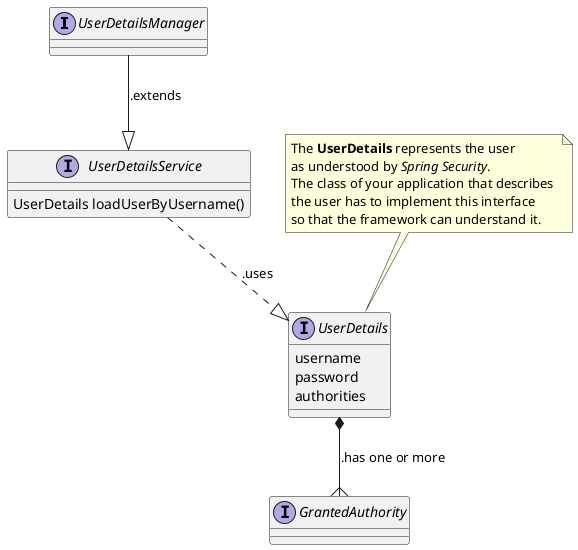

# Security

## Table of Contents

1. [Login](#1-login)
2. [Spring Security Classes](#2-spring-security-classes)
3. [Security Filters](#3-security-filters)
4. [Generate a key with OpenSSL](#4-generate-a-key-with-openssl)
5. [References](#5-references)

---
## 1. Login

You have the choice between 4 types of authentication

### 1.1. Basic

- You need to enable **Basic** authentication in SecurityConfig.java:
  `setHttpLoginMethod(http, LoginType.BASIC);`
- GET <u>localhost:8080/main</u>
	- Authorization: Basic am9objoxMjM0NQ==
	- Token class: UsernamePasswordAuthenticationToken

`BasicAuthenticationFilter → ProviderManager → DaoAuthenticationProvider → JpaUserDetailsService`

### 1.2. Form

- You need to enable **Form** authentication in SecurityConfig.java:
  `setHttpLoginMethod(http, LoginType.FORM);`
- POST <u>localhost:8080/login</u>
	- Body = form-data
	- username = ...
	- password = ...
	- Token class: UsernamePasswordAuthenticationToken

`UsernamePasswordAuthenticationFilter → ProviderManager → DaoAuthenticationProvider → JpaUserDetailsService`

### 1.3. OAuth2 ResourceServer

- NOTE: to invoke the URL below, you'll first need to be **authenticated**,
  since OAUTH2 is an **authorization** protocol.
- You need to enable **OAUTH2 RS** in SecurityConfig.java:
  `setHttpLoginMethod(http, LoginType.OAUTH2_RS);`
- POST localhost:8080/token (with basic authentication) => returns JWT
- JWTDecoder:
	- **symmetric** (NimbusJwtDecoder.withSecretKey) or
	- **asymmetric** (NimbusJwtDecoder.withPublicKey) (encryption = private key; decryption = public key)
- With the JWT:
- GET localhost:8080/main
	- Authorization: Bearer Token: (jwt) => returns main page
	- Token class: BearerTokenAuthenticationToken

`BearerTokenAuthenticationFilter → ProviderManager → JwtAuthenticationProvider`

### 1.4. OAuth2 Client

- Here we'll delegate the **authentication** part to GitHub (for instance) using the **OpenID** protocol
- You need to enable **OAuth2 Client** in SecurityConfig.java:
  `setHttpLoginMethod(http, LoginType.OAUTH2_CLIENT);`
- GET <u>localhost:8080/login</u>
- In the login page, there will be a link to Authenticate via GITHUB if application.yml is correctly configured

---
## 2. Spring Security Classes

### 2.1. Overview of the main classes

Filter

* __GenericFilterBean__: anything that wants to be a Filter in the Spring world
* __OncePerRequestFilter__: even if the same filter is registered multiple times, it will be executed only once

User

* __UserDetails__: interface, provides core user information `username / password / authorities)`
* __UserDetailsService__: interface that loads user-specific data: `UserDetails loadByUsername(username)`
* __UserDetailsManager__: interface, extends UserDetailsService to create/update users
* __User__: implementation of __UserDetails__



Authentication

* __AbstractAuthenticationToken__: Base Class for Authentication objects
* __AbstractAuthenticationProcessingFilter__: filter for HTTP based authentication requests
* __AbstractUserDetailsAuthenticationProvider__: provider designed for UsernamePasswordAuthenticationToken
* __AuthenticationManager__: attempts to authenticate the given Authentication object, returning a fully populated Authentication object (included authorities) if successful


### 2.2. AbstractAuthenticationProcessingFilter (extensions)

* __UsernamePasswordAuthenticationFilter__ (token = UsernamePasswordAuthenticationToken) ---> AbstractAuthenticationProcessingFilter
* __(custom).JwtClientCredentialFilter__ (token = JwtClientCredentialToken) ---> AbstractAuthenticationProcessingFilter
* __OAuth2LoginAuthenticationFilter__ (token = OAuth2LoginAuthenticationToken) ---> AbstractAuthenticationProcessingFilter


### 2.3. AuthenticationManager (implementations)

* __ProviderManager__ (iterates an Authentication request through a list of AuthenticationProvider) ---> AuthenticationManager


### 2.4. AuthenticationProvider (implementations)

* __DaoAuthenticationProvider__ (provider that retrieves person details from a UserDetailsService) ---> AbstractUserDetailsAuthenticationProvider ---> AuthenticationProvider
* __JwtAuthenticationProvider__ ---> AuthenticationProvider


### 2.5. UserDetailsService (implementations)

* __InMemoryUserDetailsManager__ ---> UserDetailsManager ---> UserDetailsService
* __JdbcUserDetailsManager__ ---> UserDetailsManager ---> UserDetailsService
* __JpaUserDetailsService__ ---> UserDetailsService
* __(custom).UserDetailsServiceImpl__ ---> UserDetailsService

### 2.6. Spring OAuth2

[Spring Security modules](https://docs.spring.io/spring-security/reference)

* spring-security-oauth2-authorization-server
	- AuthorizationServerSettings

* spring-security-oauth2-resource-server
	- JwtAuthenticationProvider ---> AuthenticationProvider
	- BearerTokenAuthenticationToken ---> AbstractAuthenticationToken
	- BearerTokenAuthenticationFilter ---> OncePerRequestFilter

* spring-security-oauth2-client
	- OAuth2LoginAuthenticationFilter

### 2.7. OAuth2 Providers

* GitHub: https://github.com/settings/developers
	- OAuthApps (client id; client secret)

---
## 3. Security Filters

1. org.springframework.security.web.session.DisableEncodeUrlFilter
2. org.springframework.security.web.context.request.async.WebAsyncManagerIntegrationFilter
3. org.springframework.security.web.context.SecurityContextPersistenceFilter
4. org.springframework.security.web.header.HeaderWriterFilter
5. org.springframework.security.web.authentication.logout.LogoutFilter

**OAuth Client**
* org.springframework.security.oauth2.client.web.OAuth2AuthorizationRequestRedirectFilter
* org.springframework.security.oauth2.client.web.OAuth2LoginAuthenticationFilter

**OAuth RS**
* org.springframework.security.oauth2.server.resource.web.authentication.BearerTokenAuthenticationFilter

**BASIC**
* org.springframework.security.web.authentication.www.BasicAuthenticationFilter

**FORM**
* org.springframework.security.web.authentication.UsernamePasswordAuthenticationFilter

1. org.springframework.security.web.savedrequest.RequestCacheAwareFilter
2. org.springframework.security.web.servletapi.SecurityContextHolderAwareRequestFilter
3. org.springframework.security.web.authentication.AnonymousAuthenticationFilter 
4. org.springframework.security.web.session.SessionManagementFilter 
5. org.springframework.security.web.access.ExceptionTranslationFilter 
6. org.springframework.security.web.access.intercept.FilterSecurityInterceptor

--- 
## 4. Generate a key with OpenSSL

* Asymmetric Key Pair: One key to sign the token and a different key is used to verify the signature
* Symmetric Key: The same key is used for signing the token and verifying the signature

* KEYPAIR: `openssl genrsa -out keypair.pem 2048`
* PUBLIC KEY: `openssl rsa -in keypair.pem -pubout -out public.pem`
* PRIVATE KEY: `openssl pkcs8 -topk8 -inform PEM -outform PEM -nocrypt -in keypair.pem -out private.pem`
* SYMMETRIC KEY: NimbusJwtDecoder.withJwkSetUri


```java
	// How to generate a pair of public/private key programmatically
	JWKSource generateJwtSource() {
		KeyPairGenerator kpg=KeyPairGenerator.getInstance("RSA");
		kpg.initialize(2048);
		KeyPair kp=kpg.generateKeyPair();
		RSAPrivateKey privateKey=(RSAPrivateKey)kp.getPrivate();
		RSAPublicKey publicKey=(RSAPublicKey)kp.getPublic();

		RSAKey key=new RSAKey.Builder(rsaKeys.publicKey()).privateKey(rsaKeys.privateKey()).build();
		JWKSet keySet=new JWKSet(key);
		return new ImmutableJwkSet<>(keySet); // returns JWKSource
	}
```

---
## 5. References

### 5.1. Sites

* Spring Security documentation
	- https://docs.spring.io/spring-security/reference/servlet/architecture.html

### 5.2. Books

* Spring Security in Action
	- https://www.manning.com/books/spring-security-in-action
	
### 5.3. Videos

* Spring Security JWT: How to Secure your Spring Boot Rest API with JWT
	- https://www.youtube.com/watch?v=KYNR5js2cXE
* Spring Security JWT: Secure your REST APIs with Spring Security & Symmetric Key Encryption
	- https://www.youtube.com/watch?v=66DtzkhBlSA
* Spring Security JWT: How to authenticate with a username and password
	- https://www.youtube.com/watch?v=UaB-0e76LdQ
* Spring Security JWT: Implementing the client (frontend) using JWT
	- https://www.youtube.com/watch?v=6kFzJZCW1Qw
* The new Spring Security (OAuth2 AS)
	- https://www.youtube.com/watch?v=LlVy9Roh_bQ
* Spring Security, demystified
	- https://www.youtube.com/watch?v=iJ2muJniikY
