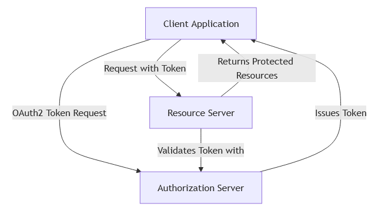

# Security

## Table of Contents

1. [Login](#1-login)
2. [Spring Security Classes](#2-spring-security-classes)
3. [Security Filters](#3-security-filters)
4. [Generate a key with OpenSSL](#4-generate-a-key-with-openssl)
5. [References](#5-references)

---

## 1. Login

You have the choice between 3 types of authentication: `basic`, `form`, `oauth2`

### 1.1. Basic

- You need to enable **Basic** authentication in SecurityConfig.java:
  `setHttpLoginMethod(http, LoginType.BASIC);`
- GET <u>localhost:8080/main</u>
    - Authorization: Basic am9objoxMjM0NQ==
    - Token class: UsernamePasswordAuthenticationToken

`BasicAuthenticationFilter → ProviderManager → DaoAuthenticationProvider → JpaUserDetailsService`

### 1.2. Form

- You need to enable **Form** authentication in SecurityConfig.java:
  `setHttpLoginMethod(http, LoginType.FORM);`
- POST <u>localhost:8080/login</u>
    - Body = form-data
    - username = ...
    - password = ...
    - Token class: UsernamePasswordAuthenticationToken

`UsernamePasswordAuthenticationFilter → ProviderManager → DaoAuthenticationProvider → JpaUserDetailsService`

### 1.3. OAuth2

- You need to enable **OAuth** authentication in SecurityConfig.java:
  `setHttpLoginMethod(http, LoginType.OAUTH2_CLIENT);`

#### Grant types

The main grant types (workflows) are:

1. Authorization Code
2. PKCE (like Authorization Code, but more secure)
3. Client Credentials (for machine-to-machine communication)
4. Implicit Flow (like Authorization Code, but less secure) - DEPRECATED
5. Password Grant (where username/password are exchanged on the network) - DEPRECATED

#### Architecture



#### OAuth2 AuthorizationServer (AS)

- Handles authentication (the name is misleading) and issues OAuth2 tokens

```yml
spring:
  security:
    oauth2:
      authorizationserver:
        # this server
        issuer: "http://<as-server>"
```

#### OAuth2 ResourceServer (RS)

- Protects your valuable data (resources)
- Needs a connection to the AS to validate a token from the client

```yml
spring:
  security:
    oauth2:
      resourceserver:
        jwt:
          issuer-uri: "http://<as-server>/realms/<realm>"
          jwt-set-uri: "http://<as-server>/realms/<realm>/protocol/openid-connect/certs"
```

- The **jwk-set-uri** contains the public key the server can use to verify the token's signature.
- The **issuer-uri** points to the base Authorization Server URI that can be used to verify the _iss_ claim as an
  added security measure.
- Class **OAuth2ResourceServerProperties** (prefix = "spring.security.oauth2.resourceserver")

#### OAuth2 Client

- Your application making the secure calls to access the data (resources)

```yml
spring:
  security:
    oauth2:
      client:
        # class ClientRegistration in oauth2-client
        registration:
          my-client-application:
            provider: my-provider
            client-id: my-client
            client-secret: my-secret
            authorization-grant-type: client_credentials | authorization_code ...
            scope: read ...
        provider:
          # cf. above
          my-provider:
            token-uri: "http://<as-server>/oauth2/token"
```
  
---

## 2. Spring Security Classes

### 2.1. Overview of the main classes

Filters

| Class                | Description                                                                         |
|----------------------|-------------------------------------------------------------------------------------|
| GenericFilterBean    | anything that wants to be a Filter in the Spring world                              |
| OncePerRequestFilter | even if the same filter is registered multiple times, it will be executed only once |

UserDetails

| Class              | Description                                                                     |
|--------------------|---------------------------------------------------------------------------------|
| UserDetails        | interface, provides core user information `(username / password / authorities)` |
| UserDetailsService | interface that loads user-specific data: `UserDetails loadByUsername(username)` |
| UserDetailsManager | interface, extends UserDetailsService to create/update users                    |
| User               | implementation of __UserDetails__                                               |

Authentication

| Class                                     | Description                                                                                                               |
|-------------------------------------------|---------------------------------------------------------------------------------------------------------------------------|
| AbstractAuthenticationToken               | base Class for Authentication objects ---> Authentication                                                                 |
| AbstractAuthenticationProcessingFilter    | filter for HTTP based authentication requests                                                                             |
| AuthenticationManager                     | attempts to authenticate the given Authentication object, returning a fully populated Authentication object if successful |
| AuthenticationProvider                    | takes care of the authentication logic; default implementation delegates the responsibility to a `UserDetailsService`     |
| AbstractUserDetailsAuthenticationProvider | provider designed for `UsernamePasswordAuthenticationToken`                                                               |
| AuthenticationEntryPoint                  | customizes the response for a failed authentication                                                                       |
| ClientRegistration                        | use this object to define the details the client needs to use the AS                                                      |
| ClientRegistrationRepository              | implement this contract to define the logic that retrieves the client registrations                                       |

### 2.2. UserDetails hierarchy


### 2.3. AbstractAuthenticationProcessingFilter (extensions)

| Class                                | Extends                                                                                   |
|--------------------------------------|-------------------------------------------------------------------------------------------|
| UsernamePasswordAuthenticationFilter | (token = UsernamePasswordAuthenticationToken) ---> AbstractAuthenticationProcessingFilter |
| (custom).JwtClientCredentialFilter   | (token = JwtClientCredentialToken) ---> AbstractAuthenticationProcessingFilter            |
| OAuth2LoginAuthenticationFilter      | (token = OAuth2LoginAuthenticationToken) ---> AbstractAuthenticationProcessingFilter      |

### 2.4. AuthenticationManager (implementations)

| Class           | Implements                                                                      |
|-----------------|---------------------------------------------------------------------------------|
| ProviderManager | (iterates through a list of AuthenticationProviders) ---> AuthenticationManager |

### 2.5. AuthenticationProvider (implementations)

| Class                                       | Extends                                                                    |
|---------------------------------------------|----------------------------------------------------------------------------|
| DaoAuthenticationProvider                   | ---> AbstractUserDetailsAuthenticationProvider ---> AuthenticationProvider |
| JwtAuthenticationProvider                   | ---> AuthenticationProvider                                                |
| OAuth2LoginAuthenticationProvider           | ---> AuthenticationProvider                                                |
| OidcAuthorizationCodeAuthenticationProvider | ---> AuthenticationProvider                                                |

### 2.6. UserDetailsService (implementations)

| Class                           | Extends                                         |
|---------------------------------|-------------------------------------------------|
| InMemoryUserDetailsManager      | ---> UserDetailsManager ---> UserDetailsService |
| JdbcUserDetailsManager          | ---> UserDetailsManager ---> UserDetailsService |
| JpaUserDetailsService           | ---> UserDetailsService                         |
| (custom).UserDetailsServiceImpl | ---> UserDetailsService                         |

### 2.7. Spring OAuth2 dependencies

[Spring Security modules](https://docs.spring.io/spring-security/reference)

* **spring-security-oauth2-authorization-server**
    - AuthorizationServerSettings

* **spring-security-oauth2-resource-server**
    - JwtAuthenticationProvider ---> AuthenticationProvider
    - BearerTokenAuthenticationToken ---> AbstractAuthenticationToken
    - BearerTokenAuthenticationFilter ---> OncePerRequestFilter

* **spring-security-oauth2-client**
    - OAuth2LoginAuthenticationFilter ---> AbstractAuthenticationProcessingFilter ---> GenericFilterBean
    - OAuth2LoginAuthenticationToken ---> AbstractAuthenticationToken
    - OAuth2LoginAuthenticationProvider ---> AuthenticationProvider
    - OidcAuthorizationCodeAuthenticationProvider ---> AuthenticationProvider
    - DefaultOAuth2AuthorizedClientManager ---> OAuth2AuthorizedClientManager

### 2.8. OAuth2 Providers

* (Spring OAuth2 Client).CommonOAuth2Provider: list of well-known providers
* GitHub: https://github.com/settings/developers
    - OAuthApps (client id; client secret)

---

## 3. Security Filters

To display the list of security filters, set the flag debug to true in the annotation `@EnableWebSecurity`

```java

@EnableWebSecurity(debug = true)
public class SecurityConfig {
    // ...
}
```

**Before**

- org.springframework.security.web.session.DisableEncodeUrlFilter
- org.springframework.security.web.context.request.async.WebAsyncManagerIntegrationFilter
- org.springframework.security.web.context.SecurityContextPersistenceFilter
- org.springframework.security.web.header.HeaderWriterFilter
- org.springframework.security.web.csrf.CsrfFilter (if CSRF is not disabled)
- org.springframework.security.web.authentication.logout.LogoutFilter

**BASIC**

- `org.springframework.security.web.authentication.www.BasicAuthenticationFilter`

**FORM**

- `org.springframework.security.web.authentication.UsernamePasswordAuthenticationFilter`

**OAUTH CLIENT**

- `org.springframework.security.oauth2.client.web.OAuth2AuthorizationRequestRedirectFilter`
- `org.springframework.security.oauth2.client.web.OAuth2LoginAuthenticationFilter`

**OAUTH RS**

- `org.springframework.security.oauth2.server.resource.web.authentication.BearerTokenAuthenticationFilter`

**After**

- org.springframework.security.web.savedrequest.RequestCacheAwareFilter
- org.springframework.security.web.servletapi.SecurityContextHolderAwareRequestFilter
- org.springframework.security.web.authentication.AnonymousAuthenticationFilter
- org.springframework.security.web.access.ExceptionTranslationFilter
- org.springframework.security.web.access.intercept.AuthorizationFilter

--- 

## 4. Generate a key with OpenSSL

* Asymmetric Key Pair: One key to sign the token and a different key is used to verify the signature
* Symmetric Key: The same key is used for signing the token and verifying the signature

* KEYPAIR: `openssl genrsa -out keypair.pem 2048`
* PUBLIC KEY: `openssl rsa -in keypair.pem -pubout -out public.pem`
* PRIVATE KEY: `openssl pkcs8 -topk8 -inform PEM -outform PEM -nocrypt -in keypair.pem -out private.pem`
* SYMMETRIC KEY: NimbusJwtDecoder.withJwkSetUri

```java
    // How to generate a pair of public/private key programmatically
JWKSource generateJwtSource() {
    KeyPairGenerator kpg = KeyPairGenerator.getInstance("RSA");
    kpg.initialize(2048);
    KeyPair kp = kpg.generateKeyPair();
    RSAPrivateKey privateKey = (RSAPrivateKey) kp.getPrivate();
    RSAPublicKey publicKey = (RSAPublicKey) kp.getPublic();

    RSAKey key = new RSAKey.Builder(rsaKeys.publicKey()).privateKey(rsaKeys.privateKey()).build();
    JWKSet keySet = new JWKSet(key);
    return new ImmutableJwkSet<>(keySet); // returns JWKSource
}
```

---

## 5. References

### 5.1. Sites

* Spring Security documentation
    - https://docs.spring.io/spring-security/reference/servlet/architecture.html

### 5.2. Books

* Spring Security in Action (2 editions)
    - https://www.manning.com/books/spring-security-in-action
    - https://www.manning.com/books/spring-security-in-action-second-edition

### 5.3. Videos

* Spring Security: RestClient Support for OAuth2
    - https://www.youtube.com/watch?v=nFKcJDpUuZ8
* Spring Security JWT: How to Secure your Spring Boot Rest API with JWT
    - https://www.youtube.com/watch?v=KYNR5js2cXE
* Spring Security JWT: Secure your REST APIs with Spring Security & Symmetric Key Encryption
    - https://www.youtube.com/watch?v=66DtzkhBlSA
* Spring Security JWT: How to authenticate with a username and password
    - https://www.youtube.com/watch?v=UaB-0e76LdQ
* Spring Security JWT: Implementing the client (frontend) using JWT
    - https://www.youtube.com/watch?v=6kFzJZCW1Qw
* The new Spring Security (OAuth2 AS)
    - https://www.youtube.com/watch?v=LlVy9Roh_bQ
* Spring Security, demystified
    - https://www.youtube.com/watch?v=iJ2muJniikY

### 5.4. GitHub

- https://github.com/danvega/golf-scheduler/blob/main/README.md
